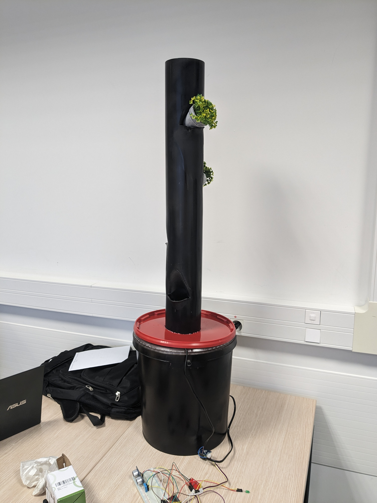

# MIoT_HomeGardenProject

Projet de tour hydroponique ESIR3 - Réalisé par Yelli COULIBALY, Corentin DAVID, Théo GRAVEC, Marine HILLIOU et Gloria MONTCHO

## Présentation du projet : 

https://github.com/mhilliou/MIoT_HomeGardenProject/blob/main/Pr%C3%A9sentation%20du%20projet%20du%201302.pdf

Le projet vise à créer une tour hydroponique innovante et facilement accessible pour un usage domestique dans des appartements. Conçu pour être à la fois compact, portable et économe en énergie, cette tour hydroponique offre une solution pratique pour cultiver des plantes à l'intérieur, sans nécessiter de jardin extérieur ou de grandes surfaces de culture.

 

## Architecture : 

## Application mobile : 

